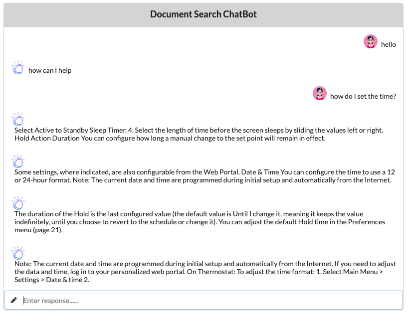

# watson-discovery-sdu-chatbot

* Searches on document in Disco
* UI is a chatbot where user enters search query
* Reply will be return disco passage (maybe multiple)

# TODO:

* Improve UI
* Come up with good questions that show better results

> Assumes completion of discovery setup described in https://github.com/rhagarty/watson-discovery-sdu-ui.

# Steps:

1. Configure credentials to disco collection with SDU
1. Run UI locally

# Configure credentials
The credentials for you collection can be found by clicking the dropdown button located at the top right of the panel. Use these values to populate your `.env` file in the next step.

<p align="center">
  
</p>

```bash
cp env.sample .env
```

Edit the `.env` file with the necessary settings.

#### `env.sample:`

```bash
# Copy this file to .env and replace the credentials with
# your own before starting the app.

# Watson Discovery
DISCOVERY_URL=<add_discovery_url>
DISCOVERY_IAM_APIKEY=<add_discovery_iam_apikey>
DISCOVERY_ENVIRONMENT_ID=<add_discovery_environment_id>
DISCOVERY_COLLECTION_ID=<add_discovery_collection_id>

# Run locally on a non-default port (default is 3000)
# PORT=3000
```

# Run locally

```bash
npm install
npm start
```

Access the UI by pointing your browser at `localhost:3000`.

Sample questions:

* **how do I set a schedule?**
* **how do I set the temperature?**
* **how do I set the time?**

# Sample Output



